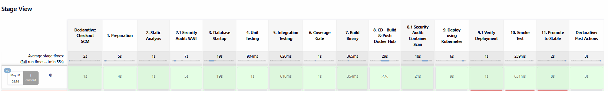
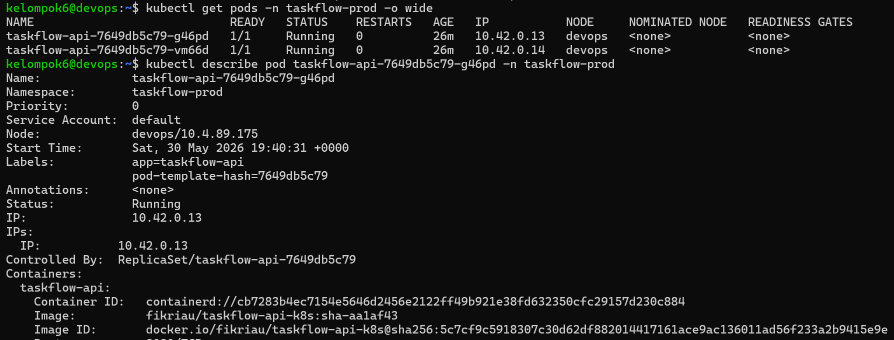
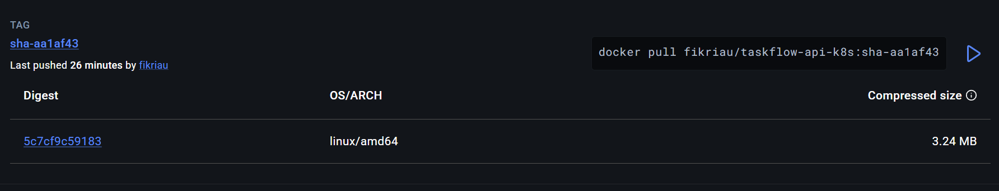
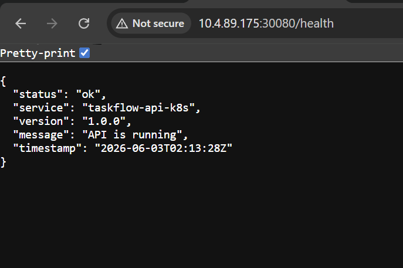

# CI/CD ke Kubernetes (Jenkins Pipeline)

## Screenshot
1. Pipeline Jenkins berhasil dijalankan setelah push code ke GitHub.


2. Image yang baru berjalan di Kubernetes setelah proses deploy selesai.


3. Tag image terbaru yang sudah terupdate di Docker Hub.


4. Get API ke endpoint health untuk memastikan API sudah berjalan dengan baik setelah deploy.



## Alur CI/CD yang Digunakan

Pada sistem ini, deployment ke Kubernetes dilakukan otomatis melalui Jenkins setelah seluruh proses CI berhasil.

```text
Developer Push Code
        │
        ▼
Jenkins Pipeline
  ├─ go vet (static analysis)
  ├─ unit test + integration test
  ├─ coverage gate
  ├─ build Docker image
  ├─ push Docker Hub
        │
        ▼
SSH ke VPS
        │
        ▼
kubectl set image deployment/taskflow-api
        │
        ▼
Rolling update Kubernetes
        │
        ▼
Pod lama diganti pod baru (zero downtime)
```

## Deployment ke Kubernetes (Jenkins)

Di pipeline Jenkins, proses deploy dilakukan dengan update image:
```
kubectl set image deployment/taskflow-api \
taskflow-api=${IMAGE_TAG} \
-n taskflow-prod
```
Lalu diverifikasi dengan:
```
kubectl rollout status deployment/taskflow-api \
-n taskflow-prod \
--timeout=120s
```
Stage tambahan untuk verifikasi deployment:
```
kubectl get pods -n taskflow-prod

kubectl get deployment taskflow-api -n taskflow-prod -o jsonpath="{.spec.template.spec.containers[0].image}"
```

Set image digunakan untuk memperbarui image container pada Kubernetes Deployment. 
Ketika image berubah, Kubernetes Deployment secara otomatis memicu rolling update melalui Deployment controller, 
yang akan mengganti pod lama dengan pod baru secara bertahap tanpa downtime.

Perintah rollout status digunakan untuk memantau proses rolling update agar memastikan deployment berhasil selesai sebelum pipeline lanjut.

Selanjutnya, dilakukan verifikasi menggunakan kubectl get pods untuk memastikan pod baru sudah berjalan dan dalam status Running. Dengan demikian dapat dipastikan proses rollout berjalan dengan baik tanpa error.

## Pertanyaan

1. **Apa yang terjadi jika build gagal?**   Jika build gagal pada GitHub Actions, maka job setelahnya seperti deploy tidak akan dijalankan karena adanya dependency needs: build. Hal ini memastikan pipeline berhenti lebih awal (fail fast) ketika terjadi kesalahan. Pada implementasi Jenkins yang kita gunakan, prinsipnya sama, yaitu jika proses test atau build Docker gagal, maka stage deploy ke Kubernetes tidak akan dieksekusi. Dengan demikian, tidak ada image yang gagal atau tidak valid yang akan di-deploy ke cluster.

2. **Mengapa kita pakai needs: build di job deploy?**
Pada GitHub Actions, needs: build digunakan untuk memastikan bahwa job deploy hanya berjalan jika proses build telah berhasil. Tujuannya adalah untuk menjamin bahwa image yang akan dideploy sudah valid dan siap digunakan. Pada Jenkins, walaupun tidak menggunakan syntax needs, konsep yang sama tetap diterapkan karena stage dieksekusi secara berurutan. Artinya, stage deploy hanya akan berjalan setelah semua tahap sebelumnya seperti test dan build berhasil dijalankan.

3. **Apa bedanya dengan deploy manual lama?**
Pada metode deploy manual, proses deployment dilakukan secara langsung menggunakan perintah seperti kubectl apply atau kubectl set image secara manual, sehingga lebih rentan terhadap human error, tidak konsisten, dan berpotensi melewatkan langkah penting. Sedangkan pada pendekatan CI/CD seperti Jenkins atau GitHub Actions, seluruh proses mulai dari push kode, testing, build, hingga deploy dilakukan secara otomatis. Hal ini membuat proses lebih cepat, konsisten, memiliki audit log, serta hanya akan melakukan deploy jika semua tahap pengujian telah berhasil.