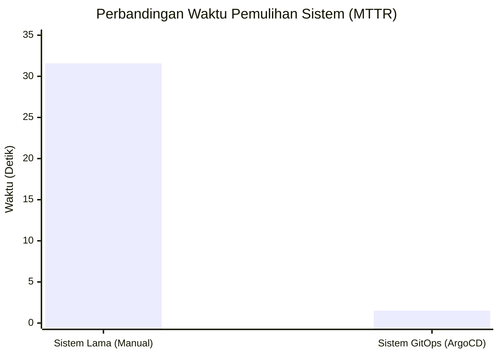
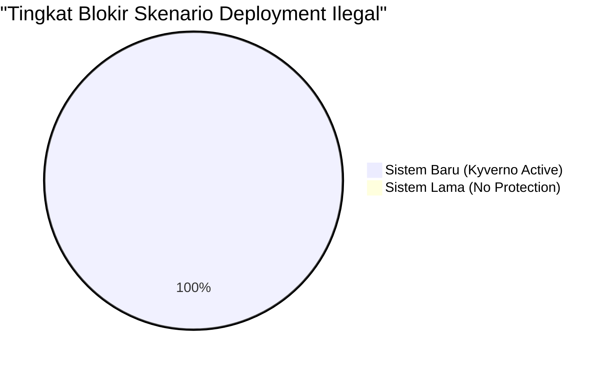

# Analisis Komprehensif Arsitektur DevSecOps (Before vs After)
# Anggota 1: Project Lead & Evaluator

Dokumen ini memuat analisis komparatif performa operasional antara sistem *Push-Based CI/CD* lama (Tugas 3) dan sistem *Pull-Based GitOps* baru yang telah diperkuat dengan *Policy-as-Code* (Final Project).

## 📉 1. Perbandingan MTTR (Mean Time to Remediation)

Berdasarkan data yang diukur secara empiris, simulasi *Configuration Drift* (kehilangan objek *deployment*) menunjukkan perbedaan kecepatan pemulihan yang sangat ekstrem.

### 💡 Analisis Data:
1. **Lonjakan Kecepatan:** Kecepatan rekonsiliasi dan pemulihan melonjak sangat tajam. Sistem lama membutuhkan waktu **31.581 detik**, sementara sistem GitOps hanya membutuhkan **1.522 detik**. Ini merupakan peningkatan efisiensi lebih dari **2000%**.
2. **Eliminasi Human Bottleneck:** Pada sistem lama, sebagian besar waktu (30 detik) habis terbuang karena *Discovery Time* (waktu sadar) manusia yang sangat lambat. Di sistem GitOps, *Discovery Time* adalah **instan (0 detik)** karena kontroler ArgoCD melakukan *polling* dan bereaksi terhadap *event* API Kubernetes secara *real-time*.

## 🛡️ 2. Perbandingan Keamanan Kluster (Runtime Admission)

Sistem lama hanya mengandalkan pengecekan *Static Security* (SAST) pada saat Jenkins mengeksekusi pipeline. Namun, pertahanan ini dapat ditembus jika seseorang memiliki akses langsung ke *kubeconfig* VPS.

### 💡 Analisis Data:
Dengan ditetapkannya Kyverno sebagai *Mutating & Validating Admission Webhook*, seluruh permintaan eksekusi yang masuk ke API Server akan dicegat dan disaring. Pengujian menunjukkan bahwa Kyverno memblokir **100% skenario deployment ilegal** (Root User, Untrusted Registry, No Resource Limits). Ini membuktikan keberhasilan penerapan konsep *Zero Trust* pada *layer runtime*.

## 🚀 3. Kesimpulan Final

Evolusi arsitektur dari *Push-Based Jenkins* menuju *Pull-Based GitOps* tidak hanya berhasil meningkatkan keamanan dengan mencabut hak akses *deploy* Jenkins dari VPS, tetapi juga berhasil mengubah model penanganan insiden infrastruktur dari yang sebelumnya bersifat **reaktif (menunggu manusia menekan tombol)** menjadi **proaktif (mesin menyembuhkan dirinya sendiri secara otonom)**.
