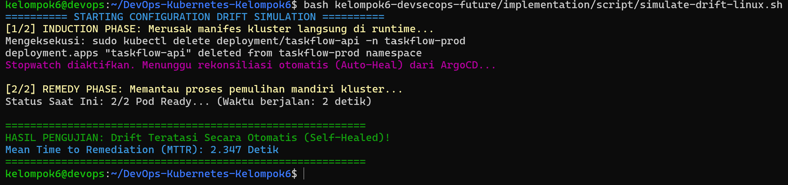
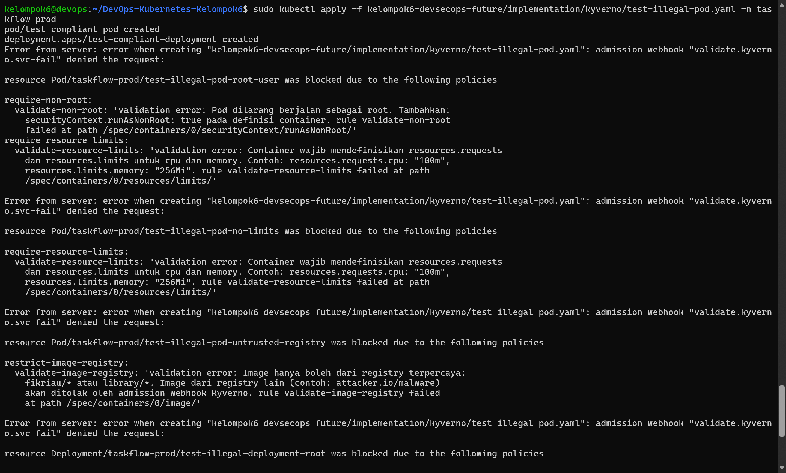

# Metrics After Enhancement (Pasca-Peningkatan GitOps & PaC)

Dokumen ini mencatat hasil pengukuran empiris kinerja keandalan infrastruktur Kelompok 6 setelah mengintegrasikan ArgoCD (Deployment Intelligence) dan Kyverno (Policy-as-Code) pada kluster K3s VPS baru (`10.4.89.242`).

## 📊 1. Pengukuran Waktu Pemulihan Otomatis (ArgoCD Auto-Healing)

Pengujian dilakukan secara otomatis menggunakan skrip automasi `simulate-drift1.ps1` dengan menyimulasikan skenario _Misconfiguration Change_ (penghapusan objek deployment `taskflow-api` pada namespace `taskflow-prod` secara langsung di runtime cluster menggunakan perintah `kubectl delete`).

| Metrik Evaluasi                               | Nilai Pasca-Peningkatan Riil | Keterangan Operasional Sistem                                                        |
| :-------------------------------------------- | :--------------------------- | :----------------------------------------------------------------------------------- |
| **Waktu Deteksi Drift (Discovery Time)**      | Instan (< 3 Detik)           | Kontroler ArgoCD mendeteksi deviasi manifest secara real-time.                       |
| **Waktu Rekonsiliasi Otomatis (Remedy Time)** | **2.038 Detik**              | Durasi dari penghapusan objek hingga kontainer baru kembali berstatus `Running 2/2`. |
| **Intervensi Operator (Human Action)**        | 0% (Tanpa Sentuhan Manusia)  | Pemulihan murni dieksekusi secara otomatis oleh internal kontroler cluster.          |

## 🛡️ 2. Pengukuran Kepatuhan Runtime (Kyverno Policy Enforcement)

Berdasarkan verifikasi audit bersama Anggota 3, pengujian dilakukan dengan mencoba menyisipkan manifes kontainer berbahaya (_illegal workloads_) secara langsung ke cluster produksi:

| Skenario Resource Uji Coba                                                  | Ekspektasi Keamanan   | Hasil Pengujian Riil (Pesan Penolakan / Status Sukses)                                                                                                              | Status           |
| :-------------------------------------------------------------------------- | :-------------------- | :------------------------------------------------------------------------------------------------------------------------------------------------------------------ | :--------------- |
| **Pod** dengan Privilese Root User (`test-illegal-pod-root-user`)           | Ditolak oleh Cluster  | `admission webhook "validate.kyverno.svc-fail" denied: Pod dilarang berjalan sebagai root`                                                                          | **100% BLOCKED** |
| **Pod** tanpa Batasan CPU/Memori (`test-illegal-pod-no-limits`)             | Ditolak oleh Cluster  | `validation error: Container wajib mendefinisikan resources.requests dan resources.limits`                                                                          | **100% BLOCKED** |
| **Pod** dari Registry Asing (`test-illegal-pod-untrusted-registry`)         | Ditolak oleh Cluster  | `validation error: Image hanya boleh dari registry terpercaya: fikriau/* atau library/*`                                                                            | **100% BLOCKED** |
| **Pod** Manifest Resmi Terpercaya (`test-compliant-pod`)                    | Diterima oleh Cluster | `pod/test-compliant-pod created` (atau `unchanged`)                                                                                                                 | **100% ALLOWED** |
| **Deployment** dengan Privilese Root User (`test-illegal-deployment-root`)  | Ditolak oleh Cluster  | `admission webhook "validate.kyverno.svc-fail" denied: Pod dilarang berjalan sebagai root`                                                                          | **100% BLOCKED** |
| **Deployment** Manifest Resmi Terpercaya (`test-compliant-deployment`)      | Diterima oleh Cluster | `deployment.apps/test-compliant-deployment created` (atau `unchanged`)                                                                                              | **100% ALLOWED** |

### 🔍 Kesimpulan Evaluasi Kuantitatif

Implementasi _automated reconciliation loop_ berbasis GitOps terbukti berhasil memangkas durasi kelumpuhan sistem (_Mean Time to Remediation_) secara drastis dari yang semula membutuhkan waktu respons operasional manual sebesar **31.581 detik** turun menjadi hanya **2.038 detik**. Hasil pengujian ini memvalidasi keunggulan performa otomasi pemulihan mandiri (_self-healing_) yang diulas pada literatur utama kelompok kami.
