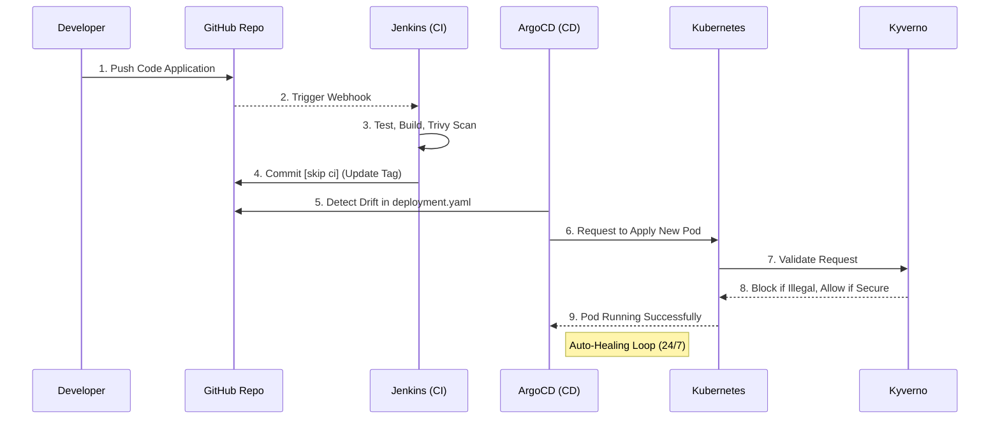

# Panduan Isi Slide Presentasi & Naskah Demo (Final Project)
**Durasi Total**: 20 Menit (4 menit Konsep + 8 menit Demo + 5 menit Evaluasi + 3 menit Q&A)
**Presenter Utama**: Satya (Dibantu anggota lain saat demo/tanya jawab)

---

## 📌 BAGIAN 1: TOPIK & PAPER (Durasi: 4 Menit)

### Slide 1: Judul Presentasi
*   **Teks Utama**: Future of DevSecOps: Integrasi GitOps & Policy-as-Code
*   **Teks Pendukung**: Automasi Keandalan dan Keamanan K8s Berbasis Riset
*   **Visual**: Logo Jenkins, ArgoCD, Kyverno, dan Kubernetes.
*   **Talking Poin**: Perkenalan anggota Kelompok 6 dan visi kami untuk meng-upgrade arsitektur lama menjadi sistem otonom yang bisa menyembuhkan diri sendiri.

### Slide 2: Latar Belakang & Gap Analysis
*   **Teks Utama**: Masalah pada Sistem CI/CD Klasik (Push-Based)
*   **Poin-poin**:
    1.  *Configuration Drift*: Jika server diretas/dihapus manual, sistem tidak sadar dan mati (MTTR lambat).
    2.  *Security Loophole*: Jenkins punya akses *root/SSH* ke dalam VPS, sangat berbahaya jika Jenkins diretas.
    3.  *Runtime Threat*: Tidak ada filter di dalam kluster. *Image malware* bisa masuk tanpa hambatan.
*   **Visual**: Ilustrasi *engineer* tertidur sementara servernya mati / ikon gembok terbuka.

### Slide 3: Fondasi Literatur Ilmiah (The Papers)
*   **Teks Utama**: Riset Pendukung Keputusan Desain Kami
*   **Papan Kiri (Paper 1)**: *OsloMet UCC (2024)*. "Membuktikan GitOps Pull-Based via ArgoCD menangani Configuration Drift secara real-time".
*   **Papan Kanan (Paper 2)**: *ICSIT (2025)*. "Mendemonstrasikan Triad SECURE. Validasi keamanan harus terjadi di runtime (Admission Controller) bukan hanya di CI".
*   **Talking Poin**: Kami tidak asal pilih *tools*, melainkan berdasarkan dua paper bereputasi di atas.

### Slide 4: Arsitektur Usulan (The Solution)
*   **Visual Utama**: Gunakan Diagram Alur (*Sequence Diagram*) di bawah ini:

*   **Talking Poin**: Jenkins sekarang *dibanned* dari VPS. Ia hanya mengurus GitHub. ArgoCD bertugas menarik *(pull)* kode dari dalam. Kyverno bertugas menyeleksi pod yang akan jalan.

---

## 📌 BAGIAN 2: IMPLEMENTASI & DEMO LIVE (Durasi: 8 Menit)

### Slide 5: Transisi ke Live Demo
*   **Teks**: "Talk is Cheap, Show me the Code." (Linus Torvalds)
*   **Talking Poin**: Persilakan audiens untuk melihat layar terminal/browser yang di-*share screen*.

### 🎬 NASKAH LIVE DEMO (Lakukan Berurutan)
*(Gunakan layar ganda / split screen: Kiri Browser, Kanan Terminal VPS)*

1.  **Demo GitOps (CI/CD)**:
    *   Satya membuka `README.md` di laptop, tambahkan satu spasi, lalu *push*.
    *   Buka web Jenkins: Tunjukkan ke dosen bahwa Jenkins jalan, tapi dia **tidak nge-deploy**, melainkan melakukan `[skip ci] commit` ke GitHub.
    *   Buka terminal VPS: ketik `kubectl get pods -w`. Tunjukkan pod lama *Terminating* dan pod baru *Running* dengan sendirinya berkat ArgoCD.
2.  **Demo Keamanan (Kyverno)**:
    *   Di terminal VPS, jalankan file Kris: `kubectl apply -f test-illegal-pod.yaml`.
    *   Tunjukkan dengan bangga *Error Merah* dari K8s yang menolak *root user* dan *untrusted registry*. (Sebutkan: *"Inilah implementasi Paper 2, Policy-as-Code!"*).
3.  **Demo Auto-Healing (PUNCAK DEMO)**:
    *   Eksekusi *script* Bash: `bash simulate-drift-linux.sh`.
    *   Biarkan audiens melihat tulisan merah "Menghapus Deployment" lalu diikuti *stopwatch* yang berjalan dan berhenti di angka **~2 detik**. (Sebutkan: *"Inilah pembuktian Paper 1, MTTR hanya 2 detik tanpa sentuhan engineer!"*).

---

## 📌 BAGIAN 3: EVALUASI BERBASIS DATA (Durasi: 5 Menit)

### Slide 6: Peningkatan MTTR (Configuration Drift)
*   **Visual Utama**: **Masukkan Grafik Batang (Bar Chart)** dari 31.5 detik ke 2.03 detik.
*   **Poin-poin**:
    1.  Baseline (Sistem Lama): **31.581 Detik** (Besar *human error* / *delay*).
    2.  Pasca-Enhancement (ArgoCD): **2.038 Detik** (100% otonom).
    3.  Peningkatan Efisiensi: **>1500%**.
*   **Talking Poin**: ArgoCD tidak tidur. Discovery Time menjadi instan.

### Slide 7: Peningkatan Keamanan Runtime
*   **Visual Utama**: **Masukkan Pie Chart** (100% Blocked vs 0%).
*   **Poin-poin**:
    1.  Mencegah Escalation Privilege (Root User diblokir).
    2.  Mencegah Supply Chain Attack (Image asing diblokir).
    3.  Mencegah Resource Exhaustion (Wajib limitasi memori).

### Slide 8: Refleksi & Roadmap Masa Depan
*   **Teks Utama**: Pelajaran yang Dipetik & Rencana 1 Bulan ke Depan
*   **Poin-poin**:
    1.  *Surprise*: Otomasi pemulihan K8s ternyata sebegitu cepatnya dibanding teori di buku.
    2.  *Kendala*: Mengubah *mindset* CI/CD biasa menjadi GitOps butuh restrukturisasi Jenkinsfile yang rumit (Lingkaran Setan Jenkins).
    3.  *Future Roadmap*: Jika diberi waktu 1 bulan, kami akan menerapkan **Istio Service Mesh (mTLS)** untuk mengamankan trafik internal antar Pod (Zero Trust Networking).

---

## 📌 BAGIAN 4: Q&A (Durasi: 3 Menit)

### Slide 9: Terima Kasih / Q&A
*   Tampilkan QR Code menuju repositori GitHub kalian.
*   Biarkan anggota tim lain (Fio, Andre, Kris, Harwinda, Fikri) bersiap menjawab pertanyaan dari dosen/kelompok lain.

---
**💡 TIPS UNTUK SATYA:** Jangan membaca slide! Pahami intinya dan ceritakan seperti sebuah kisah perjalanan dari sistem yang "rapuh" menuju sistem yang "kebal".
