# Rekomendasi Pembagian Kerja & Alur Pengerjaan Kelompok — DevOps Final Project

Dokumen ini berisi detail spesifik pekerjaan untuk setiap anggota kelompok serta **alur kerja kronologis (siapa mengerjakan apa dan kapan)** agar pengerjaan proyek berjalan efisien dan terstruktur tanpa hambatan ketergantungan (*dependency blocker*).

---

## 📅 Alur Kronologis Pengerjaan (Timeline & Alur Kerja)

Pengerjaan dibagi menjadi **4 Fase Utama** selama 1 minggu:

```mermaid
gantt
    title Alur Pengerjaan Final Project (1 Minggu)
    dateFormat  D
    axisFormat %d
    
    section Fase 1: Inisiasi & Setup
    Membaca Paper & Tulis Catatan (A2 & A3)   :a1, 1, 2d
    Gap Analysis & Setup K8s (A4 & A5)       :a2, 1, 2d
    
    section Fase 2: Implementasi
    Menulis Manifest K8s (A2)                 :b1, 3, 2d
    Menulis Kyverno Policies (A3)             :b2, 3, 2d
    Modifikasi Jenkinsfile (A4)               :b3, 3, 2d
    Mencatat Metrik Baseline (A5)             :b4, 3, 1d
    
    section Fase 3: Pengujian & QA
    Uji Drift & Remedy Time (A5)              :c1, 5, 1d
    Uji Pemblokiran Policy (A6)               :c2, 5, 1d
    Mencatat Metrik Pasca Peningkatan (A6)    :c3, 5, 1d
    
    section Fase 4: Analisis & Slides
    Analisis Data & Grafik (A1)               :d1, 6, 2d
    Mengompilasi Refleksi & Slides (A1)       :d2, 6, 2d
```

### 🏁 Fase 1: Research, Inisiasi & K8s Setup (Hari 1–2)
* **Ketergantungan**: Mulai bersamaan di hari pertama.
* **Langkah Kerja**:
  1. **Anggota 2 & Anggota 3** membaca paper masing-masing dan menyelesaikan ringkasan di folder `papers/`.
  2. **Anggota 4** menganalisis Jenkinsfile lama dan menyusun berkas `research/01-gap-analysis.md`.
  3. **Anggota 5** menginstal kluster Kubernetes lokal (misalnya Minikube/k3s) atau menyiapkan VPS bersama kelompok, kemudian menginstal ArgoCD dan Kyverno.

### 🔨 Fase 2: Implementasi Konfigurasi & Pipeline CD (Hari 3–4)
* **Ketergantungan**: Menunggu Fase 1 selesai (K8s & ArgoCD aktif).
* **Langkah Kerja**:
  1. **Anggota 2** membuat manifest aplikasi di `implementation/kubernetes/deployment.yaml` dan `service.yaml`.
  2. **Anggota 3** membuat konfigurasi ClusterPolicy di `implementation/kyverno/policies.yaml` berdasarkan manifest K8s yang dibuat Anggota 2.
  3. **Anggota 4** mengubah `Jenkinsfile` di repositori agar Jenkins otomatis meng-update nilai tag image pada manifest K8s ketika build sukses (bukan lagi menjalankan perintah SSH docker-compose).
  4. **Anggota 5** mencatat kondisi baseline sebelum peningkatan ke dalam `evaluation/metrics-before.md` (kecepatan perbaikan manual dan status kepatuhan sebelum Kyverno dipasang).

### 🧪 Fase 3: Pengujian, Uji Drift & Validasi QA (Hari 5)
* **Ketergantungan**: Menunggu Fase 2 selesai (manifest K8s, Kyverno, dan pipeline sudah terhubung).
* **Langkah Kerja**:
  1. **Anggota 5** menjalankan skrip `implementation/scripts/simulate-drift.ps1` untuk mensimulasikan kegagalan replikasi dan mencatat waktu respons pemulihan otomatis ArgoCD (*Remedy Time*).
  2. **Anggota 6** mencoba mendeploy Pod ilegal (misalnya pod berjalan sebagai root atau tanpa batas memory) untuk membuktikan Kyverno berhasil menolak manifest tersebut.
  3. **Anggota 6** mencatat data pasca-peningkatan ke berkas `evaluation/metrics-after.md`.

### 📝 Fase 4: Analisis Perbandingan, Refleksi & Slides (Hari 6–7)
* **Ketergantungan**: Menunggu Fase 3 selesai (semua data pengujian terkumpul).
* **Langkah Kerja**:
  1. **Anggota 1** mengompilasi semua data pengujian, membuat grafik perbandingan MTTR sebelum vs sesudah, dan menuliskannya di `evaluation/analysis.md`.
  2. **Anggota 1** memandu penyusunan `docs/refleksi-kelompok.md` (mengumpulkan teks dari setiap anggota sesuai dengan pembagian pertanyaan refleksi).
  3. **Anggota 1** menyusun slide presentasi di `presentation/slides.pdf` dan memimpin simulasi presentasi Zoom.
  4. **Anggota 4** menyelesaikan penulisan panduan jalankan ulang di `README.md`.

---

## 🛠️ Detail Spesifik Deskripsi Tugas (Job Description)

### 👤 Anggota 1: Project Lead & Evaluator (PM & Slides Coordinator)
* **Detail Tugas Implementasi**:
  * Melakukan review struktur folder akhir untuk memastikan tidak ada file konfigurasi yang tertinggal atau salah tempat.
  * Mengintegrasikan presentasi akhir dan mengoordinasikan waktu latihan demo presentasi berdurasi 20 menit (4 menit Paper, 8 menit Demo, 5 menit Evaluasi, 3 menit Q&A).
* **Detail Tugas Dokumentasi**:
  * **Menulis `evaluation/analysis.md`**: Membandingkan durasi remediasi drift baseline (manual) dengan pasca-peningkatan (ArgoCD), menyusun visualisasi diagram/grafik ASCII/mermaid, dan menarik kesimpulan apakah klaim Paper 1 & 2 terbukti di TaskFlow.
  * **Menyusun `presentation/slides.pdf`**: Merancang slide yang memuat latar belakang, gap, usulan arsitektur, demo, hasil evaluasi data nyata, dan refleksi.
  * **Menulis Refleksi Pertanyaan 3**: Menyusun argumen mengenai rencana perluasan sistem dalam 1 bulan (misalnya multi-cluster GitOps, canary deployment dengan Argo Rollouts, dan distributed tracing OpenTelemetry).

### 👤 Anggota 2: GitOps Engineer (Kubernetes & CD Specialist)
* **Detail Tugas Implementasi**:
  * Membuat file `implementation/kubernetes/deployment.yaml`. Kontainer harus menggunakan base image TaskFlow (`fikriau/taskflow-api:stable`), mengekspos port internal, memiliki konfigurasi `readOnlyRootFilesystem: true`, dan wajib mendefinisikan `resources` limits & requests secara spesifik (cpu & memori).
  * Membuat file `implementation/kubernetes/service.yaml` untuk mengekspos aplikasi secara internal di kluster.
  * Melakukan inisiasi awal ArgoCD Application manifest di `implementation/argocd/application.yaml` yang mengarah ke folder manifest.
* **Detail Tugas Dokumentasi**:
  * **Menulis `papers/paper-1-gitops-drift.md`**: Mengisi poin-poin metodologi Paper 1, skenario uji drift replikasi/jaringan, temuan remedy time, asumsi keterbatasan, dan 1 pertanyaan kritis terhadap paper tersebut.
  * **Menulis `research/02-state-of-the-art.md` (Bagian GitOps)**: Menjelaskan pergeseran paradigma dari push-based CD (Ansible/SSH) ke pull-based CD (ArgoCD) berdasarkan data pemulihan drift.

### 👤 Anggota 3: Security Engineer (Policy-as-Code Specialist)
* **Detail Tugas Implementasi**:
  * Menginstal Kyverno di dalam Kubernetes Cluster menggunakan Helm (`helm install kyverno kyverno/kyverno`).
  * Menulis manifest `implementation/kyverno/policies.yaml` dengan aturan:
    1. Pod wajib mendefinisikan requests/limits cpu dan memori (`require-resource-limits`).
    2. Pod dilarang berjalan sebagai user root (`runAsNonRoot: true`).
    3. Pod hanya boleh menarik image dari trusted registry (`fikriau/*` dan `library/*`).
  * Memastikan parameter `validationFailureAction` diset ke `Enforce` agar kebijakan memblokir secara aktif (bukan sekadar audit).
* **Detail Tugas Dokumentasi**:
  * **Menulis `papers/paper-2-secure-finance-cloud.md`**: Mengisi tinjauan pustaka model Triad Paper 2, implementasi Zero Trust, metodologi auditabilitas, asumsi keterbatasan, dan 1 pertanyaan kritis terhadap paper tersebut.
  * **Menulis `research/02-state-of-the-art.md` (Bagian Policy-as-Code)**: Menjelaskan pentingnya runtime admission controller di Kubernetes sebagai komplemen dari static scanning di CI.

### 👤 Anggota 4: Pipeline Specialist (Jenkins Engineer)
* **Detail Tugas Implementasi**:
  * Memodifikasi stage CD pada `Jenkinsfile` asli. Menghapus baris kode koneksi SSH (`sshagent`) ke VPS.
  * Menulis stage baru di Jenkinsfile untuk melakukan klon otomatis ke repositori konfigurasi, meng-update image tag manifest ke commit SHA terbaru (`sed -i "s|image: fikriau/taskflow-api:.*|image: fikriau/taskflow-api:sha-${commitSha}|g" deployment.yaml`), lalu melakukan git commit dan push kembali ke Git repository.
* **Detail Tugas Dokumentasi**:
  * **Menulis `research/01-gap-analysis.md`**: Menjabarkan secara mendalam risiko keamanan push-based CD (menyimpan private key SSH VPS di Jenkins), kerentanan configuration drift pada VM Docker Compose, dan tidak adanya policy enforcer di level runtime.
  * **Menulis Panduan `README.md`**: Menulis instruksi setup dari nol, command Helm untuk menginstal Kyverno dan ArgoCD, panduan apply manifest, dan cara verifikasi.

### 👤 Anggota 5: Drift Tester (Automation & Metrics Engineer)
* **Detail Tugas Implementasi**:
  * Menulis skrip `implementation/scripts/simulate-drift.ps1` yang melakukan hal berikut secara otomatis:
    1. Memverifikasi koneksi kubectl ke kluster.
    2. Menghitung durasi pemutakhiran paksa replika deployment menjadi 0 (`kubectl scale --replicas=0`).
    3. Memulai timer dan memantau status replika kluster secara berkala.
    4. Menghentikan timer ketika ArgoCD berhasil memulihkan replika kembali menjadi 2 (*self-healing*) dan Pod berstatus Ready.
    5. Menampilkan waktu Remedy Time (detik) pada terminal.
* **Detail Tugas Dokumentasi**:
  * **Menulis `evaluation/metrics-before.md`**: Mencatat data baseline MTTR ketika container mati dan harus dinyalakan kembali lewat tombol "Build Now" di Jenkins secara manual.
  * **Menulis `research/03-design-decisions.md` (Bagian GitOps)**: Menyediakan justifikasi teknis mengapa pull-based GitOps dipilih untuk meningkatkan availabilitas aplikasi berdasarkan temuan Paper 1.

### 👤 Anggota 6: QA & Policy Validator (Quality Assurance Specialist)
* **Detail Tugas Implementasi**:
  * Menyiapkan manifest Pod tidak aman (misalnya pod nginx tanpa limit CPU atau running as root) untuk pengujian.
  * Menjalankan perintah deploy manifest ilegal tersebut dan merekam pesan kesalahan penolakan (403 Forbidden) yang dikembalikan oleh Kyverno admission controller.
* **Detail Tugas Dokumentasi**:
  * **Menulis `evaluation/metrics-after.md`**: Mencatat data hasil eksekusi simulasi drift (kecepatan auto-heal) dan mendokumentasikan bukti log penolakan manifest tidak aman oleh Kyverno.
  * **Menulis `research/03-design-decisions.md` (Bagian Policy-as-Code)**: Menyediakan justifikasi teknis mengapa runtime policy dipilih untuk menegakkan kepatuhan regulasi keamanan kontainer berdasarkan temuan Paper 2.
